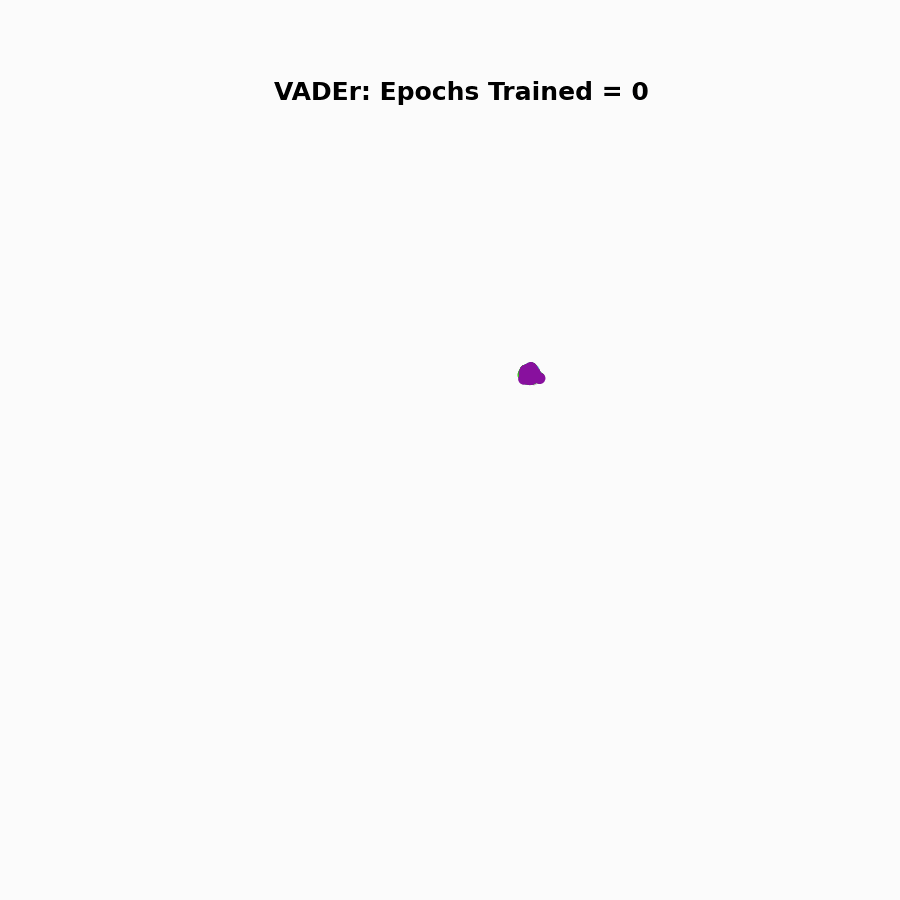

# DARTH-VADEr

        Tracking DARTH Scores in Independent Cohort.
     
    

[*I've been waiting for you, researcher... we meet (again) at last!*](https://www.youtube.com/watch?v=BT1f64RHmp0) Your presence here indicates a discontentment with status quo and a yearning for an improvement in polygenic risk scoring. Here in this hallowed repository, it is my aim to broaden the community's genomic **Vision** with the introduction of the **DARTH-VADEr** framework.

**VADEr** (<ins>V</ins>ision <ins>A</ins>dapted <ins>D</ins>isease <ins>E</ins>lucidating T<ins>r</ins>ansformer) is a Transformer-based architecture, that aims to leverage the parallel properties genomic data exhibits with the data modalities of NLP and CV, to improve polygenic risk scoring from SNP-level data. Advancement on this frontier though, without deriving interpretable insights of identified drivers of disease risk, may be seen as conceptually myopic, missing opportunities to elucidate novel genomic contributions to disease risk, impeding model trustworthiness, and ultimately precluding clinical adoption. Thus, to allay these potential concerns and broaden the applicability and appeal of this work, we jointly introduce a paired attention-based interpretability metric **DARTH** (<ins>D</ins>irected <ins>A</ins>ttention <ins>R</ins>elevance from <ins>T</ins>ransformer <ins>H</ins>euristics) scores. These scores, inspired by an [extension of Beyond Attention](https://arxiv.org/pdf/2103.15679), which provide, at a patch-level resolution, personalized insights into genomic contributions to predicted disease risk as identified by **VADEr**, have a broad range of uses, including (but not limited to) assessing VADEr attribution concordance with GWAS findings, identifying novel contributions to risk (e.g., loci or interactions), and directed training to both improve model robustness and reduce model memory usage.

In summation, this repository serves not only as an archive of the code needed to recreate our findings, but also acts as a foundational template for you to unleash **DARTH-VADEr** on any given problem in genotype-to-phenotype modeling.

Now with that having been said, *rise as my apprentice* my fellow **SNP lord**, and bring order to genotype-phenotype galaxy. Until we meet again in another repository, I wish you good fortune in the analyses to come (...*though in my experience, there's no such thing as luck*).

## Getting Started With DARTH-VADEr

For full details on how to train **VADEr** from scratch (including the wide range of supported architectural adaptations, data augmentations, custom loss formulations, and training hyperparameters supported), conducting inference with **VADEr** to generate PRSs for your dataset of interest, and computing **DARTH** scores for a **VADEr** model, jump on  over to our [documentation](https://github.com/jvtalwar/DARTH_VADEr/wiki).

## Citation

If you found our **DARTH-VADEr** framework in anyway helpful in your research, don't forget to cite our paper: [VADEr: Vision Transformer-Inspired Framework for Polygenic Risk Reveals Underlying Genetic Heterogeneity in Prostate Cancer](https://www.medrxiv.org/content/10.1101/2025.05.16.25327672v1.full.pdf)

